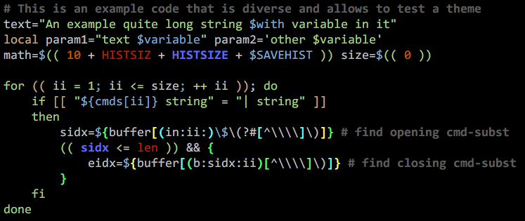

# F-Sy-H

<div align="center">
  <a href="https://github.com/z-shell/F-Sy-H">
    
  </a>

  <p>Feature-rich, interactive syntax highlighting for Zsh.</p>
  <p>
    <a href="https://github.com/z-shell/F-Sy-H/actions/workflows/zunit.yml">
      
    </a>
    <a href="LICENSE">
      
    </a>
  </p>
</div>

## Features

- Highlights Zsh syntax as a command line is edited.
- Provides command-specific chroma highlighters for tools such as Git, Docker,
  grep, and make.
- Supports shipped and user-defined themes through `fsh_theme`.
- Highlights nested command substitutions, arithmetic, strings, paths, and
  shell control structures.



## Requirements

- Zsh 5.8 or newer
- An interactive Zsh Line Editor session for live highlighting

## Portable shell contract

- Project identifier: `fsh`
- Authoritative entrypoint: `F-Sy-H.plugin.zsh`
- Public functions: `fsh_theme` and `fsh_plugin_unload`
- Public configuration context: `:fsh:config`
- Autoload paths: `functions/`, `completions/`, and the private `chroma/`

The plugin has no public aliases or public parameters. Persistent implementation
state and callbacks use the private `_fsh_` prefix. Native completion naming is
the one required exception: the completion for `fsh_theme` is `_fsh_theme`.

### Repository layout

- `F-Sy-H.plugin.zsh` is the only entrypoint.
- `lib/` contains private code sourced eagerly by the entrypoint and is not on
  `fpath`.
- `functions/` contains one autoload function per file.
- `chroma/` contains private command-specific autoload functions.
- `completions/` contains native completion functions. The plugin makes this
  directory available on `fpath` but never calls `compinit`.
- `themes/` and `share/` contain declarative INI data.
- `tests/integration/` and `tests/unit/` contain executable integration profiles
  and ZUnit specifications, respectively.

### Owned shell state

- Public functions: `fsh_theme` and `fsh_plugin_unload`
- Private persistent functions and parameters: names beginning with `_fsh_`
- Direct module requests: `zsh/parameter`, `zsh/system`, optional
  `zsh/nearcolor`, and interactive-only `zsh/zleparameter`
- Hook: `_fsh_preexec_hook` in `preexec_functions`
- Widgets: `_fsh_check_path_handler_widget`, `_fsh_widget_*` wrappers, and
  temporary `fsh-orig-*` saved-widget names

The unload function tracks modules loaded transitively during initialization
and lazy plugin operations. It only claims modules that were not loaded before
the plugin.

## Installation

### Zi

```zsh
zi light z-shell/F-Sy-H
```

Zi is the reference plugin manager for Z-Shell documentation and validation.

### Direct source

```zsh
git clone https://github.com/z-shell/F-Sy-H.git ~/path/to/f-sy-h
source ~/path/to/f-sy-h/F-Sy-H.plugin.zsh
```

### Other plugin managers

Managers that source conventional `*.plugin.zsh` entrypoints can load
`z-shell/F-Sy-H`. Detailed manager-specific examples live in the
[F-Sy-H wiki guide](https://wiki.zshell.dev/ecosystem/plugins/f-sy-h).

### Version 2 migration

This layout intentionally uses the Zsh Plugin Standard version 2 contract as a
clean interface. Existing configurations need these changes:

- Replace `fast-theme` and the `f-sy-h` alias with `fsh_theme`.
- Replace `FAST_WORK_DIR` with `zstyle ':fsh:config' work-dir ...`.
- Replace `ZSH_HIGHLIGHT_MAXLENGTH` with
  `zstyle ':fsh:config' max-length ...`.
- Replace `FAST_THEME_MANAGER_DISABLED=1` with
  `zstyle ':fsh:config' theme-manager disabled`.
- Replace direct mutation of plugin globals with the documented settings below.
- Reapply a theme with `fsh_theme`; executable legacy theme cache files are not
  loaded.

Legacy functions, aliases, parameters, and executable cache formats are not
retained as a second compatibility interface.

### Migrating from zsh-syntax-highlighting

F-Sy-H is not configuration-compatible with zsh-syntax-highlighting. Remove
`ZSH_HIGHLIGHT_STYLES` and `ZSH_HIGHLIGHT_HIGHLIGHTERS` configuration when
switching plugins. F-Sy-H does not read or translate either parameter. If one
is already declared when F-Sy-H loads, the plugin prints one migration
diagnostic without reading or changing its values.

[Zsh requires associative arrays to be declared before assigning an
element](https://zsh.sourceforge.io/Doc/Release/Parameters.html#Array-Parameters).
For example, [zsh-syntax-highlighting documents this
sequence](https://github.com/zsh-users/zsh-syntax-highlighting/blob/master/docs/highlighters/main.md#how-to-tweak-it):

```zsh
typeset -A ZSH_HIGHLIGHT_STYLES
ZSH_HIGHLIGHT_STYLES[comment]='fg=201'
```

Without the `typeset -A` line, Zsh reports `assignment to invalid subscript
range` at the assignment itself. If that assignment appears before the F-Sy-H
source or manager command, F-Sy-H has not run yet and cannot intercept the
error. Remove the legacy block instead of moving it after the F-Sy-H load.

Replace the legacy controls as follows:

| zsh-syntax-highlighting                              | F-Sy-H replacement                                                               |
| ---------------------------------------------------- | -------------------------------------------------------------------------------- |
| `ZSH_HIGHLIGHT_MAXLENGTH=1000`                       | `zstyle ':fsh:config' max-length 1000`                                           |
| `ZSH_HIGHLIGHT_HIGHLIGHTERS=(main)`                  | Main syntax highlighting is integrated and always active.                        |
| Add `brackets` to `ZSH_HIGHLIGHT_HIGHLIGHTERS`       | `zstyle ':fsh:config' bracket-highlighting enabled`                              |
| Add `pattern`, `regexp`, `cursor`, `root`, or `line` | No direct equivalent. Remove the entry or implement the behavior outside F-Sy-H. |
| `ZSH_HIGHLIGHT_STYLES[...]`                          | Copy and edit an F-Sy-H INI theme, then apply it with `fsh_theme`.               |

Many common `main` highlighter style names map directly to F-Sy-H theme keys:

| zsh-syntax-highlighting style                                              | F-Sy-H theme key |
| -------------------------------------------------------------------------- | ---------------- |
| `unknown-token`, `reserved-word`, `alias`, `suffix-alias`, `global-alias`  | Same name        |
| `builtin`, `function`, `command`, `precommand`, `hashed-command`           | Same name        |
| `commandseparator`, `path`, `path_pathseparator`, `globbing`               | Same name        |
| `history-expansion`, `single-hyphen-option`, `double-hyphen-option`        | Same name        |
| `back-quoted-argument`, `single-quoted-argument`, `double-quoted-argument` | Same name        |
| `dollar-quoted-argument`, `assign`, `redirection`, `comment`, `default`    | Same name        |

Other zsh-syntax-highlighting keys do not have a one-to-one mapping. F-Sy-H
uses more specific keys for arithmetic, loops, case blocks, here strings,
bracket levels, directories, subcommands, and command option arguments. Start
from a shipped theme so those F-Sy-H-specific styles retain valid fallbacks:

```zsh
theme_dir=${XDG_CONFIG_HOME:-$HOME/.config}/f-sy-h
mkdir -p -- "$theme_dir"
fsh_theme --copy-shipped-theme default "$theme_dir/migrated"
# Edit "$theme_dir/migrated.ini", then apply it:
fsh_theme "$theme_dir/migrated.ini"
```

Theme INI values use `red,bold` for a foreground and `bg:blue` for a
background. The corresponding zsh-syntax-highlighting forms are `fg=red,bold`
and `bg=blue`. Run `fsh_theme --help` for theme commands and see the
configuration section below for the full `:fsh:config` interface.

## Configuration

All ordinary settings use `:fsh:config`. Set them before loading the plugin:

```zsh
zstyle ':fsh:config' work-dir "${XDG_CACHE_HOME:-$HOME/.cache}/f-sy-h"
zstyle ':fsh:config' max-length 1000
zstyle ':fsh:config' theme-manager enabled
zstyle ':fsh:config' bracket-highlighting enabled
zstyle ':fsh:config' path-blocklist '/private/*' '/mnt/slow/**'
zstyle ':fsh:config' chroma-opt-in vim
zstyle ':fsh:config' chroma-cache-seconds 5
zstyle ':fsh:config' chroma-timeout-seconds 2
zi light z-shell/F-Sy-H
```

The settings are:

- `work-dir`: scalar path, default
  `${XDG_CACHE_HOME:-$HOME/.cache}/f-sy-h`.
- `max-length`: non-negative integer, default `1000`.
- `theme-manager`: boolean-like scalar, default `enabled`.
- `bracket-highlighting`: boolean-like scalar, default `enabled`.
- `path-blocklist`: array of Zsh patterns excluded from path probing, empty by
  default.
- `chroma-opt-in`: array containing `vim`, `which`, or both, empty by default.
  The `vim` chroma reads `.viminfo` and displays recent files. The `which`
  chroma runs multiple command-discovery tools while highlighting.
- `chroma-cache-seconds`: non-negative lifetime for asynchronous chroma lookup
  results, default `5`.
- `chroma-timeout-seconds`: positive time budget for an asynchronous chroma
  worker, default `2`. A worker that exceeds it is disabled for the session
  and reports one ZLE warning.

For boolean-like settings, `disabled`, `false`, `no`, `off`, and `0` disable
the feature; any other value enables it.

At or below `max-length`, edits to independent simple command lists can reuse
highlighting before a parser-confirmed top-level semicolon or newline. Quoting,
redirections, assignments, aliases, chroma, control structures, changed theme
or shell context, and other ambiguous input use a full parse. Bracket and
string highlighting still scan the complete buffer. Buffers above the limit
remain unhighlighted rather than switching to a degraded highlighting mode.

Theme file examples and additional usage guidance are documented in the
[wiki guide](https://wiki.zshell.dev/ecosystem/plugins/f-sy-h).

## Usage

List available themes:

```zsh
fsh_theme --list
```

Test a theme for the current session:

```zsh
fsh_theme --test clean
```

Apply a theme:

```zsh
fsh_theme clean
```

## Lifecycle and side effects

Interactive loading:

- adds `functions/`, `completions/`, and `chroma/` to `fpath` when absent;
- wraps existing ZLE widgets and creates the path-check handler widget;
- registers `_fsh_preexec_hook` in `preexec_functions`;
- loads the Zsh modules needed by highlighting; and
- defines the documented functions and private state above.

Non-interactive loading defines the shell API but does not change widgets or
install the `preexec` hook. Repeated sourcing is a no-op after a successful
load.

`fsh_plugin_unload` removes plugin-owned hooks, widgets, functions,
parameters, modules, and `fpath` entries. It restores state captured
before the first load only while the installed value remains unchanged. A
widget, function, or parameter changed after loading is preserved.

Loading performs no network request and does not create the cache directory.
The explicit `fsh_theme` command creates storage only when it needs to write
theme state. Saved state uses `current_theme.ini`, `theme_overlay.ini`, and
`secondary_theme.local.ini`. These files are parsed as data. Legacy writable
`*.zsh` theme caches are deliberately ignored and never sourced.

## Verification

From the repository root:

```bash
zsh -f -n F-Sy-H.plugin.zsh lib/*.zsh functions/* completions/* chroma/*
zsh -f tests/integration/test-plugin-entrypoint.zsh
zsh -f tests/integration/test-plugin-lifecycle.zsh noninteractive
zsh -f -i tests/integration/test-plugin-lifecycle.zsh interactive
zsh -f tests/integration/test-function-completion.zsh
zsh -f tests/integration/test-git-chroma-regions.zsh
zsh -f tests/integration/test-passive-safety.zsh
zsh -f tests/integration/test-hostile-autoloads.zsh
zsh -f tests/integration/test-highlight-performance.zsh
zsh -f tests/integration/test-theme-persistence.zsh
zsh -f tests/integration/test-chroma-registry.zsh
zsh -f tests/integration/test-chroma-regions.zsh
zsh -f tests/integration/test-async-chroma.zsh
zsh -f tests/integration/test-theme-validator.zsh
zsh -f tools/validate-themes.zsh
zunit
```

The highlight-performance profile measures nine parses of representative,
delimiter-free single commands at 173 and 1,000 characters after one warm-up
run. Pull-request CI compares the medians with the base revision on the same
runner and updates a PR comment with the relative difference. Hardware timing
does not gate the build; empty highlighting, steady-state lifecycle refreshes,
and failure to skip a buffer above the default limit remain test failures.

`tools/validate-themes.zsh` validates all shipped themes by default and accepts
explicit INI paths as arguments. It emits one JSON Lines record per result or
diagnostic using schema `fsh-theme-validation/v1`, and exits non-zero if any
record has `status` set to `error`. Each record's `nearcolor256` object maps
the theme's distinct truecolor style literals to the xterm-256 indices selected
by the installed Zsh `zsh/nearcolor` module. It is empty when the theme has no
truecolor styles; an unavailable module produces a structured
`nearcolor-unavailable` error.

Every shipped theme declares a `[theme]` rendering contract. Fixed-palette
themes use `palette = xterm-256` with exact `foreground` and `background`
`#rrggbb` values. Their resolved ordinary styles must reach a contrast ratio of
4.5:1; `unknown-token`, `incorrect-subtle`, and `matherr` must reach 7:1.
`palette = terminal-ansi16` is adaptive and restricts colors to terminal-owned
ANSI indices 0 through 15 instead of claiming a fixed contrast ratio. Metadata
remains optional for external themes, preserving existing user themes; when it
is present, the same validation contract applies.

That contract also keeps semantically opposed styles distinguishable. The
validator compares resolved rendering state rather than raw INI text, so named
and indexed equivalents, backgrounds, attributes, `none`, and `reverse` are
canonicalized before comparison. Single- and double-hyphen options, string and
numeric option arguments, and subcommands and string option arguments must
differ. Command and builtin styles, function and command styles, and alias and
suffix-alias styles may intentionally share a rendering. Overlays are checked
as partial customizations, so standalone overlay validation does not enforce
these pair relationships against an unknown base theme.

Fixed-palette themes also keep `correct-subtle` and `incorrect-subtle`
separated under the published
[Machado, Oliveira, and Fernandes](https://doi.org/10.1109/TVCG.2009.113)
severity-1.0 protanopia, deuteranopia, and tritanopia simulation matrices. The
validator converts each simulated foreground and background pair to
[CIE 1976 L*a*b*](https://www.cie.co.at/publications/colorimetry-part-4-cie-1976-lab-colour-space-1)
and requires at least one channel to retain a project-defined distance of
20.0. Terminal-owned ANSI palettes and standalone overlays cannot make a fixed
color claim, so this check does not apply to them. This regression guard is
not a WCAG conformance claim or a substitute for a
[non-color correctness cue](https://www.w3.org/TR/WCAG22/#use-of-color).

The ZUnit command requires the repository's pinned ZUnit toolchain.

## Documentation and support

- [F-Sy-H wiki guide](https://wiki.zshell.dev/ecosystem/plugins/f-sy-h)
- [Release history](https://github.com/z-shell/F-Sy-H/releases)
- [Zsh Plugin Standard](https://wiki.zshell.dev/community/zsh_plugin_standard)
- [Zsh documentation](https://zsh.sourceforge.io/Doc/)
- [Report an issue](https://github.com/z-shell/F-Sy-H/issues)

## Release model

Contributions integrate on `main`. F-Sy-H is consumed directly from Git;
version tags identify reviewed snapshots and do not introduce a separate
package registry.

## Contributing and license

Contributions follow the
[Z-Shell organization guidance](https://github.com/z-shell/.github).
This project is distributed under the terms in [LICENSE](LICENSE).
